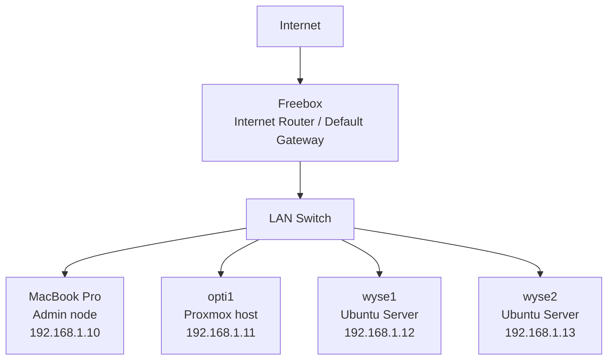

# Homelab — DevOps Learning Platform

## Context
This homelab is built as a hands-on environment to transition from software engineering to DevOps/Cloud.

It focuses on:
- infrastructure understanding
- networking fundamentals
- Kubernetes deployment and operations

---

## Hardware
- Optiplex 7050 — 8GB RAM / 4 vCPU (Proxmox)
- 2x Wyse 5070 — 4GB RAM / 2 vCPU (Ubuntu Server)
- MacBook Pro — management node

---

## Network Design
- Static IP addressing (no DHCP dependency)
- Fully operational LAN without internet access
- Freebox used as default gateway when available
- Standardized SSH access (non-root user + sudo)

---

## Architecture

---

## Current State
- Stable LAN with static addressing
- All nodes reachable via SSH
- Network operates independently from internet availability
- Infrastructure ready for cluster deployment

---

## Next Steps
- Kubernetes cluster (k3s)
- Infrastructure as Code (Terraform / Ansible)
- CI/CD pipeline integration
