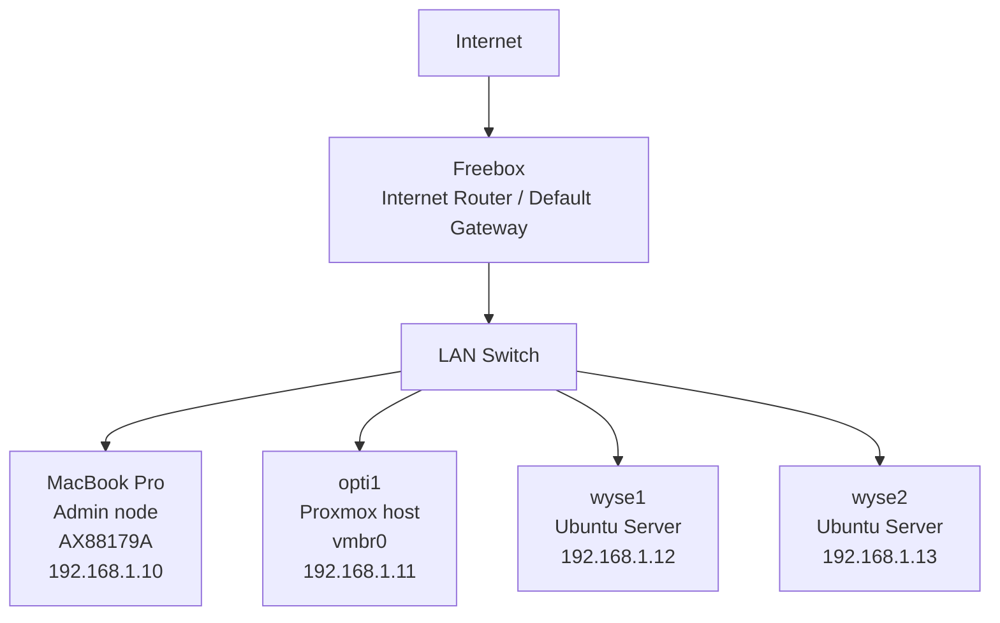
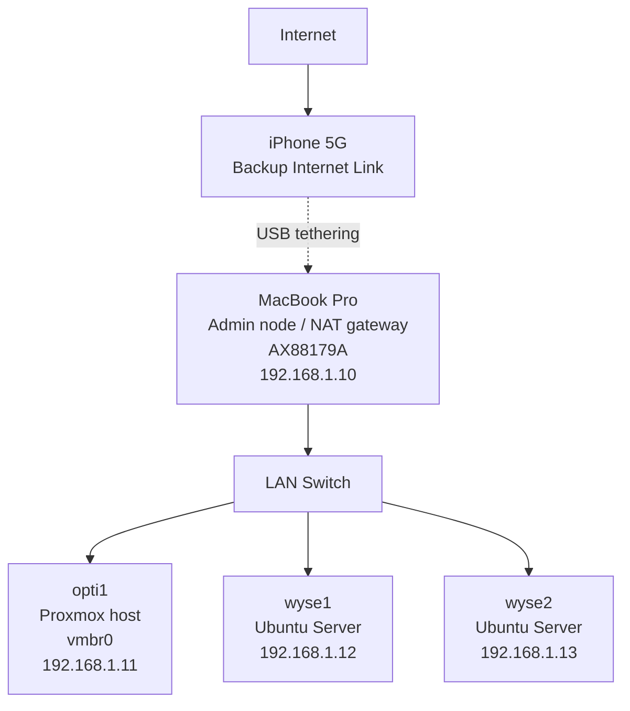

# Homelab — DevOps Learning Platform

## Context
Transitioning from software engineering to DevOps/Cloud, this homelab is used to build hands-on experience with infrastructure, networking and Kubernetes.

## Hardware
- Optiplex 7050 (Proxmox)
- 2x Wyse 5070 (Ubuntu Server)
- MacBook Pro (management node)

## Network Design
- Static IP addressing (no DHCP dependency)
- Fully operational LAN without router
- Standardized SSH access (non-root user + sudo)
- Freebox (internet router) used as default gateway
- Mac can act as NAT fallback via iPhone tethering

## Architecture

## Normal Mode

## Fallback Mode

## Key Learnings
- DHCP failure can break local connectivity (internet router was KO)
- Static IP ensures resilience
- Clear separation between LAN and internet access
- Importance of consistent access (SSH + users)

## Next Steps
- Kubernetes cluster (k3s)
- Infrastructure automation (Terraform / Ansible)
