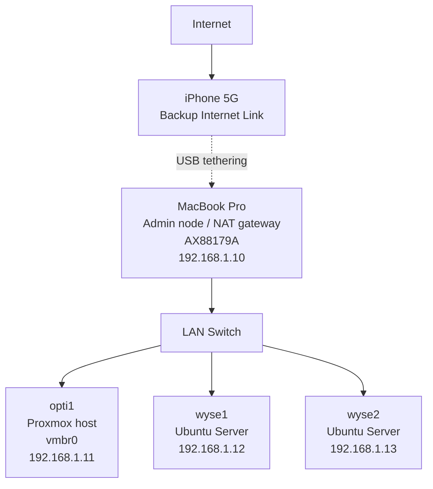

# 2026-03-25 Use Macbook as a NAT to access internet

## Context

The internet router (Freebox) became unavailable, causing a complete loss of internet connectivity for the homelab.

Although the LAN remained functional (thanks to static IP addressing), external access (apt, updates, downloads) was no longer possible.

To restore internet access without relying on the router, a fallback solution was attempted:
- use the MacBook as a NAT gateway
- provide internet via iPhone USB tethering
- keep the existing LAN unchanged (192.168.1.0/24)

The goal was to introduce a temporary internet path without reconfiguring the entire network.

---

## Fallback Internet Access (Experimental)

An attempt was made to use the MacBook as a NAT gateway via iPhone USB tethering.

Expected flow:
Nodes → MacBook → iPhone → Internet

### Result

This approach does NOT work with macOS Internet Sharing in this setup.

Reason:
- macOS creates a separate NAT network (typically 192.168.2.0/24)
- This network is isolated from the existing LAN (192.168.1.0/24)
- The MacBook does not act as a router for the existing LAN
- Existing nodes cannot reach the MacBook as a gateway

Conclusion:
- macOS Internet Sharing is not compatible with this homelab network design
- It cannot be used as a drop-in fallback gateway

---

## Future (to explore)

- Dedicated router for LAN (e.g. OpenWRT / pfSense)
- Proper WAN failover (fiber + mobile backup)
- Stable NAT gateway independent from macOS
