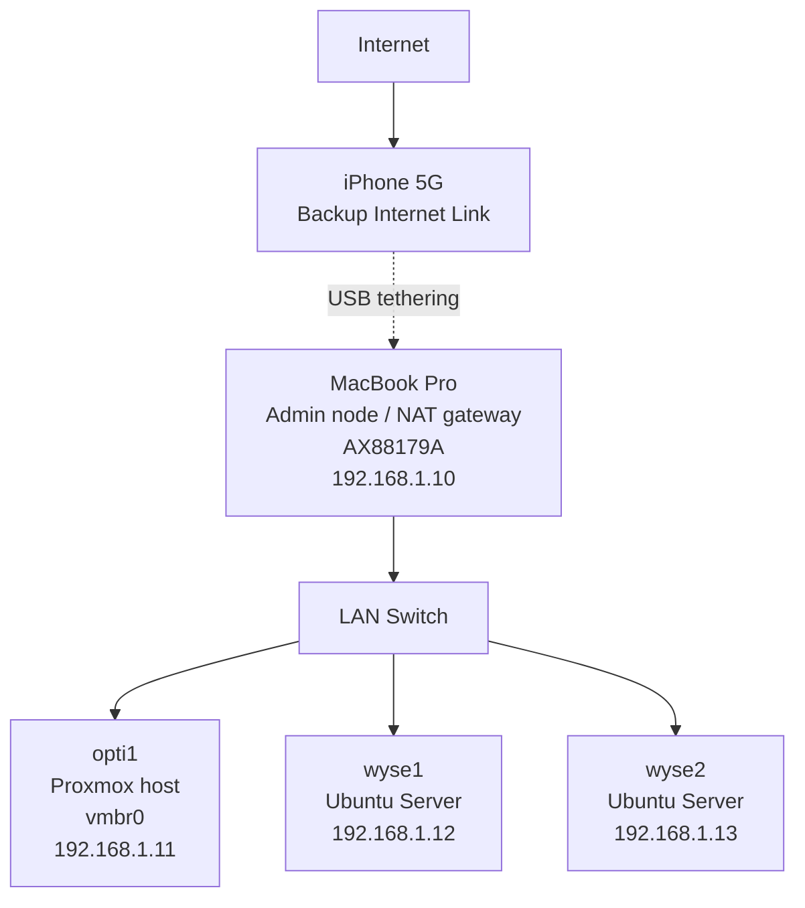

# Networking Design

## Overview

This homelab is designed to run as a simple and resilient local network.

It can:
- operate without internet
- avoid dependency on DHCP
- maintain stable connectivity between nodes

Internet access is considered optional and external to the core design.

---

## Topology

- Freebox (internet router)
- 2 Ethernet switches (cascaded)
- MacBook Pro (admin node)
- 3 nodes:
  - opti1 (Proxmox)
  - wyse1 (worker)
  - wyse2 (worker)

All devices are on the same LAN (Layer 2 network).

---

## IP Addressing

Static IPs are manually configured on each machine:

| Host     | IP Address     |
|----------|----------------|
| MacBook  | 192.168.1.10   |
| opti1    | 192.168.1.11   |
| wyse1    | 192.168.1.12   |
| wyse2    | 192.168.1.13   |

Subnet:
192.168.1.0/24

---

## Gateway

### Normal mode
- Default gateway: Freebox (192.168.1.1)
- Used for internet access (updates, downloads)

### Offline mode
- No default gateway configured
- LAN remains fully operational
- Nodes communicate directly (SSH, cluster, etc.)

---

## Fallback Internet Access (Experimental)

An attempt was made to use the MacBook as a NAT gateway via iPhone USB tethering.

Expected flow:
Nodes → MacBook → iPhone → Internet

### Result

This approach does NOT work with macOS Internet Sharing in this setup.

Reason:
- macOS creates a separate NAT network (typically 192.168.2.0/24)
- This network is isolated from the existing LAN (192.168.1.0/24)
- The MacBook does not act as a router for the existing LAN
- Existing nodes cannot reach the MacBook as a gateway

Conclusion:
- macOS Internet Sharing is not compatible with this homelab network design
- It cannot be used as a drop-in fallback gateway

---

## Design Choices

- Static IPs instead of DHCP (predictability, independence)
- LAN must function without any router
- Internet access is optional and external
- Avoid reliance on non-deterministic NAT behavior (macOS Internet Sharing)

---

## Current State

- LAN is stable and fully operational
- All nodes are reachable via static IPs
- Network works independently from internet availability

---

## Future (to explore)

- Dedicated router for LAN (e.g. OpenWRT / pfSense)
- Proper WAN failover (fiber + mobile backup)
- Stable NAT gateway independent from macOS
